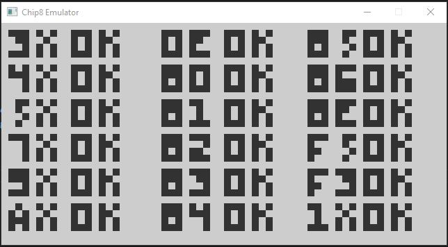
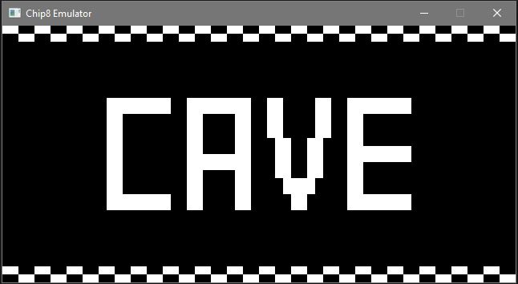

# Chip8Emulator

CHIP-8 is an interpreted programming language, developed by Joseph Weisbecker. It was initially used on the COSMAC VIP and Telmac 1800 8-bit microcomputers in the mid-1970s. CHIP-8 programs are run on a CHIP-8 virtual machine. It was made to allow video games to be more easily programmed for these computers.

## Tech

- SDL2
- CMake
- vcpkg

## References
- https://austinmorlan.com/posts/chip8_emulator/
- http://devernay.free.fr/hacks/chip8/C8TECH10.HTM
- https://en.wikipedia.org/wiki/CHIP-8
- http://www.codeslinger.co.uk/pages/projects/chip8.html
